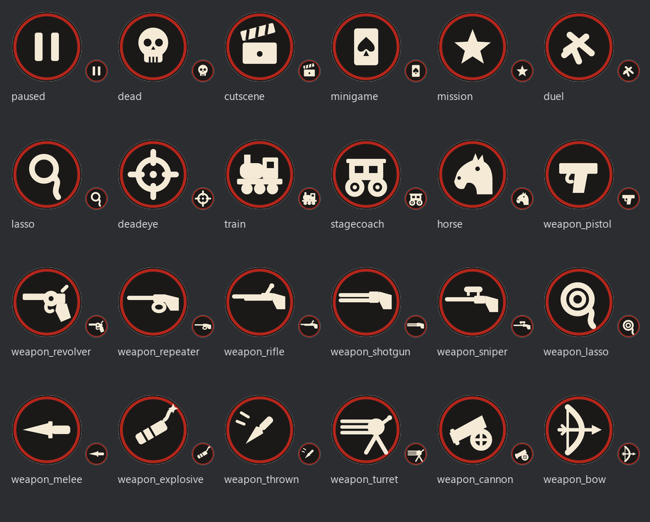

# RDR Better Presence

Discord Rich Presence détaillée pour **Red Dead Redemption** (port PC 2024), sous forme de plugin
[RedHook](https://www.nexusmods.com/reddeadredemption/mods/192) (`.red`).

Ce que Discord affiche, mis à jour en temps réel depuis le jeu :

| Ligne | Contenu | Source (natives RedHook) |
|---|---|---|
| Activité | **Mission en cours (titre)**, duel, mini-jeu (+ lieu) ; sinon Exploration libre, En fusillade, Dead Eye, À cheval / mule / taureau / bison, Train, Diligence, Lasso, Cinématique, **En pause**, Mort, Ivre, À l'intérieur… + PV % + prime « Wanted $x » | Journal du jeu (`GET_JOURNAL_ENTRY_IN_LIST`, voir plus bas), `IS_PLAYER_IN_COMBAT`, `IS_PLAYER_DEADEYE`, `IS_ACTOR_RIDING`, `IS_ACTOR_ON_TRAIN`, `IS_MINIGAME_RUNNING`, `GET_ACTOR_HEALTH`, stat 222 (prime)… |
| Lieu | Région · lieu le plus proche · heure du jeu · météo | Table de 29 repères (x, z) → région, `GET_TIME_OF_DAY`, `GET_WEATHER` |
| Grande image | Carte de la région (`region_<slug>`), survol : personnage (John / Jack) + tenue | `GET_ACTOR_ENUM`, `GET_CURRENT_ACTOR_ENUM_VARIATION` |
| Petite image | Icône d'activité ou catégorie d'arme, survol : nom de l'arme | `GET_WEAPON_IN_HAND`, `GET_WEAPON_DISPLAY_NAME` |
| Timer | Temps de jeu de la session | — |

> **Pourquoi pas UE4SS ?** Le port PC tourne sur le moteur **RAGE** de Rockstar (archives `.rpf`),
> pas sur Unreal Engine. UE4SS ne peut pas fonctionner. RedHook est le ScriptHook adapté.

### Ce que l'on a appris sur le jeu (vérifié en jeu, build 1.0.42)

- Le monde est **Y-up** : X croît vers l'est, Z vers le sud, Y est l'altitude. `GET_DISTRICTS_NAME` renvoie toujours
  `swall` (un seul district en solo) — les régions viennent d'une table de repères avec leurs coordonnées.
- **Mission en cours** : au démarrage d'une mission, le jeu ajoute à la **liste 0 du journal** une entrée de type 1
  dont le handle vaut `STRING_TO_HASH("miss<N>_short")` ; `<N>` est l'identifiant d'interface de la mission
  (`miss12` = « Exhuming and Other Fine Hobbies »). Elle disparaît à la fin. Les missions disponibles sont en
  liste 1 sous `hash("miss<N>")`. `_IS_ANY_NAMED_SCRIPT_RUNNING` ne voit que les scripts enfants de l'appelant
  et `DOES_SCRIPT_EXIST` teste l'existence du fichier : inutilisables.
- **Pause** : la VM de scripts est gelée pendant la pause, donc la fibre RedHook ne tourne plus ; le plugin
  détecte la pause quand son battement de cœur s'arrête (`IS_GAME_PAUSED` ne bouge pas).
- Les natives déclarées `int` par le SDK renvoient parfois des **floats** (`GET_PLAYER_DEADEYE_POINTS`, les stats
  SAG). La prime est le stat 222 ; l'argent n'a pas été trouvé (stat 0 ≠ argent).
- `Print` de RedHook **plante le jeu** sur certains messages longs ou riches en crochets : les lignes verbeuses
  vont uniquement dans le fichier log.

## Installation

### Automatique (recommandé)

1. Téléchargez `RDRBetterPresence-vX.Y.Z.zip` dans les [Releases](../../releases/latest) et extrayez-le n'importe où.
2. Dans le dossier extrait, clic droit sur `install.ps1` → **Exécuter avec PowerShell** (ou, dans un terminal :
   `powershell -ExecutionPolicy Bypass -File .\install.ps1`).
   Le script trouve le jeu (Rockstar Games Launcher ou Steam), télécharge RedHook v0.8 s'il n'est pas déjà là,
   et copie le plugin. Si le jeu n'est pas détecté : `.\install.ps1 -GameDir "D:\Chemin\Red Dead Redemption"`.
3. Lancez Discord, puis le jeu. C'est tout — la présence apparaît sur votre profil Discord.

Prérequis : Windows 10/11, Red Dead Redemption (port PC), Discord (application de bureau), et le
[Visual C++ Redistributable x64](https://aka.ms/vs/17/release/vc_redist.x64.exe) (requis par RedHook — le script
vous le signale s'il manque).

### Manuelle

1. [RedHook v0.8](https://github.com/K3rhos/RedHookSDK/releases/download/v0.8/RedHook.v0.8.zip) : copiez
   `winmm.dll`, `RedHook.dll` et `RedHook.ini` à la racine du jeu (à côté de `RDR.exe`).
2. Copiez `RDRBetterPresence.red`, `RDRBetterPresence.ini` et `RDRBetterPresence.regions.ini` au même endroit.
3. Lancez Discord, puis le jeu.

Le fichier `.ini` fourni contient déjà un *Application ID* Discord (l'application « Red Dead Redemption » avec ses
images). Vous pouvez y mettre le vôtre (`ClientId=`) si vous voulez vos propres images.

### Désinstallation

Supprimez `RDRBetterPresence.red` (et ses `.ini`) du dossier du jeu. Pour retirer aussi RedHook : `winmm.dll`,
`RedHook.dll`, `RedHook.ini`.

### Dépannage

- Le plugin écrit `RDRBetterPresence.log` à la racine du jeu ; **F8** en jeu ouvre la console RedHook
  (`unload RDRBetterPresence`, `load RDRBetterPresence`, `reload RDRBetterPresence` — sans guillemets).
- Image « ? » sur Discord : normal tant que l'application Discord n'a pas d'images pour les clés ci-dessous.
- Rien ne s'affiche : Discord doit être lancé **avant** le jeu (le plugin réessaie toutes les 10 s), et
  « Afficher l'activité en cours » doit être activé dans Discord → Paramètres → Statut d'activité.

## Images (Discord Developer Portal)

Les images sont hébergées par Discord dans **votre** application : *Developer Portal → votre app → Rich Presence →
Art Assets → Add Image(s)*. Le nom de l'asset doit être exactement la clé (= le nom du fichier sans `.png`).
Sans images, Discord affiche un « ? » à la place.

**Petites images (état / arme) — fournies** : les 24 icônes de [`assets/small/`](assets/small) (512 × 512, disque
sombre + anneau rouge, lisibles à 30 px) sont aussi téléchargeables en zip dans les [Releases](../../releases/latest).
Uploadez-les telles quelles.



Elles sont générées par [`assets/make_icons.py`](assets/make_icons.py) (SVG → PNG via resvg) — modifiez les
couleurs ou les formes et relancez le script.

**Grandes images — à fournir** : `rdr_logo` (image par défaut, ou une URL `https://` dans `LargeImageDefault`) et,
si `UseRegionImages=true`, une par région : `region_cholla_springs`, `region_rio_bravo`, `region_gaptooth_ridge`,
`region_hennigan_s_stead`, `region_punta_orgullo`, `region_perdido`, `region_diez_coronas`, `region_tall_trees`,
`region_great_plains`.

## Configuration

`RDRBetterPresence.ini` (lu au chargement du plugin) : langue (`fr`/`en`), éléments affichés, intervalle de
mise à jour, boutons, niveau de log. `RDRBetterPresence.regions.ini` : rectangles de coordonnées (x, z) pour
nommer des lieux supplémentaires (prioritaires sur la table intégrée) — activez `ShowCoordinates=true` pour
relever les coordonnées.

## Compilation (développeur)

Prérequis : Visual Studio 2022 Build Tools avec la charge de travail « Développement Desktop en C++ ».

```powershell
.\build.ps1                 # build Release + copie du .red et des .ini (si absents) dans le dossier du jeu
.\build.ps1 -NoDeploy       # build seulement
.\build.ps1 -GameDir "D:\Jeux\Red Dead Redemption"
.\tests\run_smoke.ps1       # teste la couche IPC Discord + le PresenceBuilder sans le jeu
```

### Architecture

```
src/
├── dllmain.cpp             DllMain → Plugin::Initialize / Shutdown
├── Plugin.cpp              orchestration : fibre de script RedHook + thread Discord
├── Config.*                lecture du .ini
├── Log.*                   log fichier + console F8 (thread-safe)
├── discord/DiscordIPC.*    protocole RPC Discord sur named pipe (handshake, SET_ACTIVITY, PING/PONG)
├── discord/Json.h          mini-sérialiseur JSON
├── game/GameState.*        échantillonnage de l'état du jeu via les natives (fibre de script uniquement)
├── game/Regions.*          repères (x, z) + rectangles utilisateur → région, lieu, slug d'asset
├── game/Journal.*          mission en cours via le journal du jeu (hash des libellés miss<N>_short)
└── presence/PresenceBuilder.*, Localization.h   GameSnapshot → Activity (FR / EN)
sdk/                        RedHook SDK vendored (MIT, © K3rhos)
```

Deux threads : la **fibre de script RedHook** appelle les natives toutes les `PollIntervalMs` et publie un
`GameSnapshot` ; le **thread Discord** possède le pipe, reconstruit l'`Activity` et n'envoie que si elle a
changé, au plus une fois par `UpdateIntervalMs`. Les natives ne sont jamais appelées hors de la fibre, le
pipe jamais touché depuis la fibre.

## Crédits

- [K3rhos](https://github.com/K3rhos) — RedHook, RedHookSDK, RDR-PC-Natives-DB
- [EvilBlunt](https://github.com/EvilBlunt/RDR-Strings-and-Enums) — enums tenues / météo
