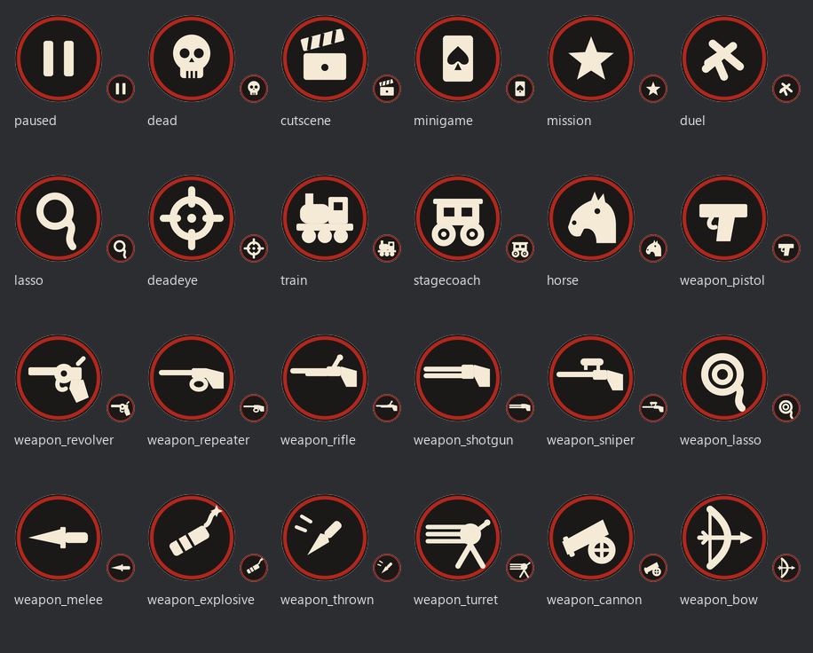

# RDR Better Presence

Affiche en temps réel ce que vous faites dans **Red Dead Redemption** (port PC) sur votre profil Discord :
la mission en cours, l'endroit où vous êtes, l'heure du jeu, la météo, votre arme, votre monture…

```
Red Dead Redemption
Mission: Exhuming and Other Fine Hobbies · HP 100%
Cholla Springs · Coot's Chapel · 8:15 PM · Cloudy
⏱ 42:17
```

Le mod est un plugin [RedHook](https://www.nexusmods.com/reddeadredemption/mods/192) (`.red`). Il ne modifie aucun
fichier du jeu, ne touche pas aux sauvegardes, et se retire en supprimant deux fichiers.

---

# Tutoriel d'installation

Comptez 5 minutes. Suivez les étapes dans l'ordre.

## Étape 1 — Vérifier les prérequis

| Ce qu'il vous faut | Comment vérifier / obtenir |
|---|---|
| **Windows 10 ou 11** (64 bits) | Touche `Windows` + `Pause` → « Type du système : 64 bits ». |
| **Red Dead Redemption**, port PC (2024) | Acheté sur Rockstar Games Launcher, Steam ou Epic. Testé avec `RDR.exe` version 1.0.42. |
| **Discord**, l'application de bureau | [Télécharger Discord](https://discord.com/download). La version dans le navigateur **ne fonctionne pas** : le mod a besoin de l'application installée. |
| **Visual C++ Redistributable x64** | [Télécharger vc_redist.x64.exe](https://aka.ms/vs/17/release/vc_redist.x64.exe) et l'installer. Il est souvent déjà présent — l'installateur du mod vous le dira. |

**Activez l'affichage d'activité dans Discord** (sinon personne ne verra la présence) :
Discord → ⚙️ **Paramètres utilisateur** → **Confidentialité de l'activité** → activez
« **Afficher l'activité en cours dans votre statut** ».

## Étape 2 — Télécharger le mod

1. Ouvrez la page [**Releases**](../../releases/latest).
2. Dans la section *Assets*, téléchargez **`RDRBetterPresence-vX.Y.Z.zip`**.
3. **Extrayez le zip** (clic droit → *Extraire tout…*) n'importe où : Bureau, Téléchargements, peu importe.
   ⚠️ N'exécutez rien depuis l'intérieur du zip sans l'avoir extrait.

Le dossier extrait contient :

```
install.ps1                      ← le script d'installation
RDRBetterPresence.red            ← le mod
RDRBetterPresence.ini            ← ses réglages
RDRBetterPresence.regions.ini    ← lieux personnalisés (optionnel)
README.md / LICENSE
```

## Étape 3 — Fermer le jeu

Si Red Dead Redemption est lancé, **quittez-le complètement**. L'installateur refusera de continuer sinon
(les fichiers du jeu sont verrouillés pendant qu'il tourne).

## Étape 4 — Lancer l'installateur

Dans le dossier extrait, **clic droit sur `install.ps1` → « Exécuter avec PowerShell »**.

<details>
<summary>Windows bloque le script ? (cliquez pour dérouler)</summary>

Si rien ne se passe ou si Windows refuse d'exécuter le script, ouvrez un terminal PowerShell dans le dossier
(clic droit dans le dossier, en maintenant `Maj` → *Ouvrir la fenêtre PowerShell ici*) puis tapez :

```powershell
powershell -ExecutionPolicy Bypass -File .\install.ps1
```

</details>

Le script fait tout seul :

- il **trouve le dossier du jeu** (Rockstar Games Launcher, Steam, toutes lettres de lecteur) ;
- il **télécharge et installe RedHook v0.8** s'il n'est pas déjà là (depuis sa page GitHub officielle) ;
- il **copie le mod** et ses réglages ;
- il **vérifie le Visual C++ Redistributable**.

Vous devez voir, en vert :

```
Game folder: E:\Program Files\Rockstar Games\Red Dead Redemption
RedHook installed (winmm.dll, RedHook.dll, RedHook.ini).
Installed RDRBetterPresence.red
Installed RDRBetterPresence.ini
Installed RDRBetterPresence.regions.ini
Visual C++ x64 redistributable present (14.51).

Done. Start Discord, then the game.
```

**Le jeu n'est pas trouvé ?** Indiquez le dossier vous-même (celui qui contient `RDR.exe`) :

```powershell
powershell -ExecutionPolicy Bypass -File .\install.ps1 -GameDir "D:\Chemin\Vers\Red Dead Redemption"
```

<details>
<summary>Comment trouver le dossier du jeu</summary>

- **Rockstar Games Launcher** : Paramètres → *Red Dead Redemption* → *Ouvrir l'emplacement du fichier*.
  Chemin habituel : `C:\Program Files\Rockstar Games\Red Dead Redemption`
- **Steam** : clic droit sur le jeu → *Gérer* → *Parcourir les fichiers locaux*.
- Le bon dossier est celui qui contient **`RDR.exe`**.

</details>

## Étape 5 — Jouer

1. **Lancez Discord en premier** et laissez-le ouvert.
2. **Lancez Red Dead Redemption.**
3. Chargez votre partie : au bout de quelques secondes, la présence apparaît sur votre profil Discord.

C'est fini. À chaque partie, il suffit que Discord soit lancé avant le jeu.

---

## Installation manuelle (sans le script)

Si vous préférez tout faire à la main :

1. Téléchargez [**RedHook v0.8**](https://github.com/K3rhos/RedHookSDK/releases/download/v0.8/RedHook.v0.8.zip),
   extrayez-le, et copiez **`winmm.dll`**, **`RedHook.dll`** et **`RedHook.ini`** dans le dossier du jeu
   (celui qui contient `RDR.exe`).
2. Copiez **`RDRBetterPresence.red`**, **`RDRBetterPresence.ini`** et **`RDRBetterPresence.regions.ini`**
   dans ce même dossier.
3. Installez le [Visual C++ Redistributable x64](https://aka.ms/vs/17/release/vc_redist.x64.exe) si ce n'est pas fait.
4. Lancez Discord, puis le jeu.

## Mettre à jour le mod

Téléchargez la nouvelle release et relancez `install.ps1` (ou recopiez seulement `RDRBetterPresence.red`).
Vos réglages sont conservés : le script ne remplace jamais un `.ini` existant.

## Désinstaller

Supprimez du dossier du jeu : `RDRBetterPresence.red`, `RDRBetterPresence.ini`,
`RDRBetterPresence.regions.ini`, `RDRBetterPresence.log`.
Pour retirer aussi RedHook : `winmm.dll`, `RedHook.dll`, `RedHook.ini`.
Le jeu redevient parfaitement vanilla.

---

## Problèmes fréquents

| Symptôme | Cause et solution |
|---|---|
| **Rien ne s'affiche sur Discord** | Discord doit être lancé **avant** le jeu (le mod réessaie toutes les 10 s, laissez-lui un moment). Vérifiez aussi que « Afficher l'activité en cours » est activé (étape 1). |
| **Un « ? » à la place de l'image** | L'application Discord utilisée n'a pas encore d'images. Voir [Images personnalisées](#images-personnalisées-optionnel) — c'est purement cosmétique, le texte fonctionne. |
| **« failed to load RedHook.dll »** au lancement du jeu | Le Visual C++ Redistributable x64 manque : [installez-le](https://aka.ms/vs/17/release/vc_redist.x64.exe). |
| **Le jeu plante au démarrage** | Renommez `RDRBetterPresence.red` en `RDRBetterPresence.red.off` et relancez. S'il plante encore, le problème vient de RedHook (ou d'un autre mod) : retirez aussi `winmm.dll`, `RedHook.dll`, `RedHook.ini`. |
| **L'installateur dit que le jeu tourne** | Quittez complètement le jeu (vérifiez dans le Gestionnaire des tâches qu'aucun `RDR.exe` ne reste). |
| **Je veux savoir ce que fait le mod** | Il écrit `RDRBetterPresence.log` dans le dossier du jeu. **F8** en jeu ouvre la console RedHook : `unload RDRBetterPresence`, `load RDRBetterPresence`, `reload RDRBetterPresence` (sans guillemets) pour recharger les réglages sans quitter la partie. |

---

## Réglages (`RDRBetterPresence.ini`)

Le fichier se trouve dans le dossier du jeu, à côté de `RDR.exe`. Il est relu au lancement du jeu
(ou avec `reload RDRBetterPresence` dans la console F8). Les options les plus utiles :

| Option | Effet |
|---|---|
| `Language=en` | Langue de la présence : `en` ou `fr`. |
| `ShowTimeOfDay`, `ShowWeather` | Heure du jeu et météo sur la 2ᵉ ligne. |
| `ShowHealth` | Pourcentage de vie. |
| `ShowWeapon` | Arme en main (petite image + texte au survol). |
| `ShowOutfit` | Tenue portée, au survol de la grande image. |
| `ShowMissions` | Titre de la mission en cours, duels, mini-jeux. |
| `ShowBounty` | « Wanted $x » quand une prime est sur votre tête. |
| `Button1Label` / `Button1Url` | Ajoute un bouton sous la présence (votre chaîne, votre serveur…). |
| `ClientId` | L'application Discord utilisée pour les images (voir ci-dessous). |
| `UpdateIntervalMs=15000` | Délai minimum entre deux mises à jour. Discord limite à ~5 par 20 s : ne descendez pas sous 4000. |

`RDRBetterPresence.regions.ini` permet d'ajouter vos propres lieux par coordonnées. Mettez
`ShowCoordinates=true` dans le `.ini` principal pour lire vos coordonnées directement sur la présence.

---

## Images personnalisées (optionnel)

Les images de la présence sont hébergées par **une application Discord**. Le mod utilise celle indiquée par
`ClientId` dans le `.ini`. Pour avoir vos propres images :

1. Allez sur le [Discord Developer Portal](https://discord.com/developers/applications) → **New Application**.
   Donnez-lui le nom qui doit apparaître sur la présence, par exemple *Red Dead Redemption*.
2. Dans **General Information**, copiez l'**Application ID** (une longue suite de chiffres) et collez-le dans
   `RDRBetterPresence.ini` : `ClientId=votre_id`.
3. Allez dans **Rich Presence → Art Assets → Add Image(s)** et uploadez les images.
   Le nom de chaque asset doit être **exactement** la clé attendue (= le nom du fichier sans `.png`).
4. Relancez le jeu. Comptez quelques minutes : Discord met un peu de temps à diffuser les images neuves.

**Les petites icônes sont fournies** : les 25 PNG du dossier [`assets/small/`](assets/small) (512 × 512), aussi
disponibles en zip dans les [Releases](../../releases/latest). Uploadez-les telles quelles.



**Les grandes images sont à vous de choisir** (captures du jeu, cartes des régions…) :

- `rdr_logo` — image par défaut. Vous pouvez aussi mettre une URL `https://…` directement dans
  `LargeImageDefault` au lieu d'uploader une image.
- Une par région si `UseRegionImages=true` : `region_cholla_springs`, `region_rio_bravo`,
  `region_gaptooth_ridge`, `region_hennigan_s_stead`, `region_punta_orgullo`, `region_perdido`,
  `region_diez_coronas`, `region_tall_trees`, `region_great_plains`.

Une clé sans image ne casse rien : Discord affiche simplement un espace vide.

---

## Ce que la présence affiche

| Ligne | Contenu |
|---|---|
| Activité | **Mission en cours (titre)**, duel, mini-jeu (+ lieu) ; sinon À pied, En fusillade, Dead Eye, À cheval / mule / taureau / bison, Train, Diligence, Lasso, Cinématique, En pause, Mort, Ivre, À l'intérieur… + PV % + prime « Wanted $x » |
| Lieu | Région · lieu le plus proche · heure du jeu · météo |
| Grande image | Carte de la région ; au survol : personnage (John / Jack) + tenue |
| Petite image | Icône d'activité ou catégorie d'arme ; au survol : nom de l'arme |
| Timer | Temps de jeu de la session |

---

# Partie technique (développeurs)

> **Pourquoi pas UE4SS ?** Le port PC tourne sur le moteur **RAGE** de Rockstar (archives `.rpf`),
> pas sur Unreal Engine. UE4SS ne peut pas fonctionner. RedHook est le ScriptHook adapté.

## Compilation

Prérequis : Visual Studio 2022 Build Tools avec la charge de travail « Développement Desktop en C++ ».

```powershell
.\build.ps1                 # build Release + copie du .red et des .ini (si absents) dans le dossier du jeu
.\build.ps1 -NoDeploy       # build seulement
.\build.ps1 -GameDir "D:\Jeux\Red Dead Redemption"
.\tests\run_smoke.ps1       # teste la couche IPC Discord + le PresenceBuilder sans le jeu
python assets\make_icons.py # régénère les petites images (SVG → PNG via resvg)
```

## Architecture

```
src/
├── dllmain.cpp             DllMain → Plugin::Initialize / Shutdown
├── Plugin.cpp              orchestration : fibre de script RedHook + thread Discord
├── Config.*                lecture du .ini
├── Log.*                   log fichier + console F8 (thread-safe)
├── discord/DiscordIPC.*    protocole RPC Discord sur named pipe (handshake, SET_ACTIVITY, PING/PONG)
├── discord/Json.h          mini-sérialiseur JSON
├── game/GameState.*        échantillonnage de l'état du jeu via les natives (fibre de script uniquement)
├── game/Regions.*          repères (x, z) + rectangles utilisateur → région, lieu, slug d'asset
├── game/Journal.*          mission en cours via le journal du jeu (hash des libellés miss<N>_short)
└── presence/PresenceBuilder.*, Localization.h   GameSnapshot → Activity (FR / EN)
sdk/                        RedHook SDK vendored (MIT, © K3rhos)
```

Deux threads : la **fibre de script RedHook** appelle les natives toutes les `PollIntervalMs` et publie un
`GameSnapshot` ; le **thread Discord** possède le pipe, reconstruit l'`Activity` et n'envoie que si elle a
changé, au plus une fois par `UpdateIntervalMs`. Les natives ne sont jamais appelées hors de la fibre, le
pipe n'est jamais touché depuis la fibre.

## Ce que l'on a appris sur le jeu (vérifié en jeu, build 1.0.42)

- Le monde est **Y-up** : X croît vers l'est, Z vers le sud, Y est l'altitude. `GET_DISTRICTS_NAME` renvoie toujours
  `swall` (un seul district en solo) — les régions viennent d'une table de repères avec leurs coordonnées.
- **Mission en cours** : au démarrage d'une mission, le jeu ajoute à la **liste 0 du journal** une entrée de type 1
  dont le handle vaut `STRING_TO_HASH("miss<N>_short")` ; `<N>` est l'identifiant d'interface de la mission
  (`miss12` = « Exhuming and Other Fine Hobbies »). Elle disparaît à la fin. Les missions disponibles sont en
  liste 1 sous `hash("miss<N>")`. `_IS_ANY_NAMED_SCRIPT_RUNNING` ne voit que les scripts enfants de l'appelant
  et `DOES_SCRIPT_EXIST` teste l'existence du fichier : inutilisables.
- **Pause** : la VM de scripts est gelée pendant la pause, donc la fibre RedHook ne tourne plus ; le plugin
  détecte la pause quand son battement de cœur s'arrête (`IS_GAME_PAUSED` ne bouge pas).
- Les natives déclarées `int` par le SDK renvoient parfois des **floats** (`GET_PLAYER_DEADEYE_POINTS`, les stats
  SAG). La prime est le stat 222 ; l'argent n'a pas été trouvé (stat 0 ≠ argent).
- `Print` de RedHook **plante le jeu** sur certains messages longs ou riches en crochets : les lignes verbeuses
  vont uniquement dans le fichier log.

## Crédits

- [K3rhos](https://github.com/K3rhos) — RedHook, RedHookSDK, RDR-PC-Natives-DB
- [EvilBlunt](https://github.com/EvilBlunt/RDR-Strings-and-Enums) — enums tenues / météo

Licence MIT (voir [LICENSE](LICENSE)).
